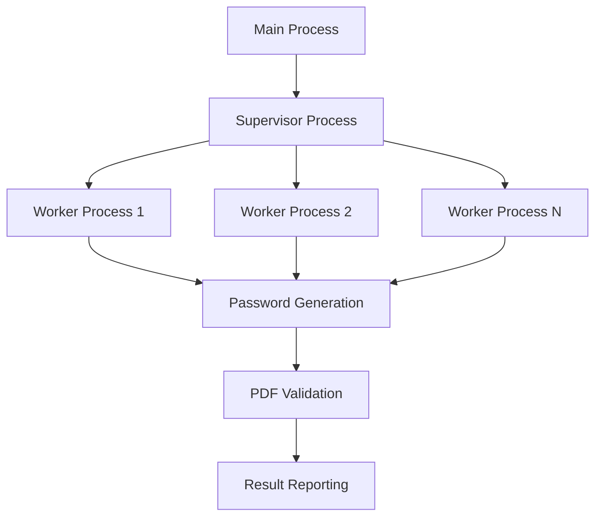

# PDF-PyCrack

<div align="center">

[](https://badge.fury.io/py/pdf-pycrack)
[](https://opensource.org/licenses/MIT)
[](https://www.python.org/downloads/)
[](https://github.com/psf/black)
[](https://github.com/astral-sh/uv)
[](https://codecov.io/gh/hornikmatej/pdf_pycrack)

**A not yet blazing fast, parallel PDF password cracker for Python 3.12+**

</div>

---

## Overview

PDF-PyCrack is a high-performance, multi-core PDF password cracking tool designed for security professionals, researchers, and anyone who needs to recover passwords from encrypted PDF files. Built with Python 3.12+, it leverages all available CPU cores to maximize cracking speed while maintaining efficient memory usage.

## Key Features

### 🚀 **High Performance**
- **Multi-core Processing**: Utilizes all CPU cores for maximum speed
- **Efficient Memory Usage**: Handles large PDFs with minimal RAM consumption
- **Optimized Algorithms**: Smart password generation and validation

### 🛡️ **Robust & Reliable**
- **Resilient Workers**: Worker processes handle errors gracefully
- **Comprehensive Error Handling**: Clear error messages and recovery suggestions
- **Progress Tracking**: Real-time progress bars and detailed statistics

### ⚙️ **Highly Configurable**
- **Flexible Character Sets**: Numbers, letters, special characters, or custom sets
- **Adjustable Parameters**: Password length, batch sizes, worker counts
- **Multiple Interfaces**: Command-line tool and Python library

### 🧪 **Well Tested**
- **Comprehensive Test Suite**: 90%+ code coverage
- **Error Scenario Testing**: All edge cases covered
- **Benchmarking Tools**: Performance measurement and comparison

## Quick Example

=== "Command Line"

    ```bash
    # Install from PyPI
    uv pip install pdf-pycrack

    # Crack a PDF password
    pdf-pycrack encrypted_file.pdf

    # Custom settings
    pdf-pycrack file.pdf --min-len 4 --max-len 6 --charset-numbers --charset-letters
    ```

=== "Python Library"

    ```python
    from pdf_pycrack import crack_pdf_password, PasswordFound

    result = crack_pdf_password(
        pdf_path="encrypted_file.pdf",
        min_len=4,
        max_len=6,
        charset="0123456789abcdef"
    )

    if isinstance(result, PasswordFound):
        print(f"Password found: {result.password}")
        print(f"Cracking took: {result.duration:.2f} seconds")
    ```

## Architecture

PDF-PyCrack uses a sophisticated multi-process architecture:



- **Main Process**: Handles CLI, progress display, and result collection
- **Supervisor Process**: Coordinates worker processes and manages task distribution
- **Worker Processes**: Generate and test password combinations in parallel
- **Error Isolation**: Worker failures don't affect the main cracking process

## Use Cases

### Security Testing
Perfect for penetration testers and security researchers who need to:
- Test PDF password strength
- Recover forgotten passwords for legitimate files
- Assess organizational security policies

### Digital Forensics
Ideal for forensic investigators who need to:
- Access encrypted evidence files
- Recover documents with unknown passwords
- Analyze password patterns and complexity

### Personal Use
Great for individuals who need to:
- Recover forgotten PDF passwords
- Access legacy encrypted documents
- Batch process multiple protected files

## Performance

PDF-PyCrack is designed for speed. On a modern 8-core system:

- **Simple passwords (4-6 chars, numbers)**: ~1M passwords/second
- **Complex passwords (6-8 chars, mixed)**: ~500K passwords/second
- **Memory usage**: <100MB for most operations
- **Scalability**: Linear performance improvement with CPU cores

!!! tip "Performance Tips"
    - Use SSD storage for better I/O performance
    - Ensure adequate RAM (8GB+ recommended)
    - Close unnecessary applications to free up CPU cores
    - Use specific character sets when possible to reduce search space

## Getting Started

Ready to start cracking? Check out our [Quick Start Guide](getting-started/quickstart.md) or jump straight to [Installation](getting-started/installation.md).

For detailed usage instructions, see the [User Guide](user-guide/cli.md), and for programmatic usage, check out the [Python Library Documentation](user-guide/library.md).

## Legal Notice

!!! warning "Important Legal Information"
    PDF-PyCrack is intended for legitimate use only:

    - ✅ **Authorized testing** of your own files
    - ✅ **Security research** with proper permissions
    - ✅ **Password recovery** for files you own
    - ❌ **Unauthorized access** to files you don't own
    - ❌ **Illegal activities** or copyright infringement

    Users are responsible for ensuring their use complies with applicable laws and regulations.

## Community & Support

- 📝 **Documentation**: You're reading it!
- 🐛 **Bug Reports**: [GitHub Issues](https://github.com/hornikmatej/pdf_pycrack/issues)
- 💡 **Feature Requests**: [GitHub Discussions](https://github.com/hornikmatej/pdf_pycrack/discussions)
- 🤝 **Contributing**: [Contribution Guide](development/contributing.md)
